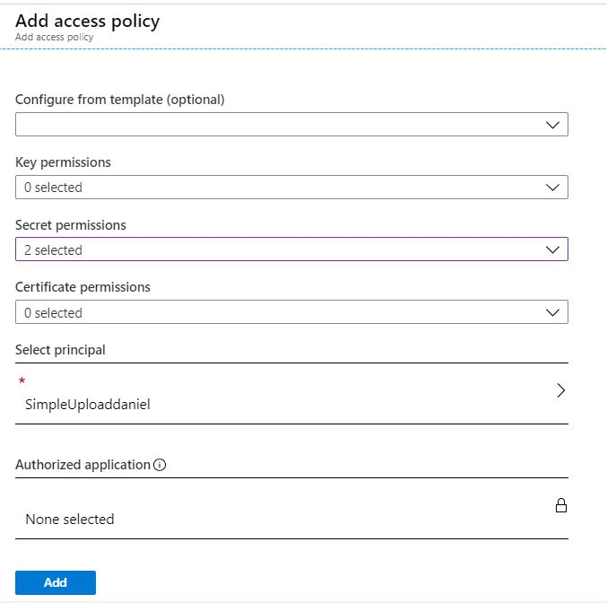

# assessment1

This project demonstrates how we can upload files from browser to an Azure Storage Account

## Limitations and Considerations
1. Most file formats are supported.

### I Deploy Required Resources

1. Click the below button to upload the provided ARM template to the Azure portal, which is written to automatically deploy and configure the following resources:   
	1.1 An Azure Datalake Gen 2 storage account  
	1.2 An Azure storage account  (note 4, below)  
	1.3 A key vault with a secret  
	1.4 A virtual network  
	1.5 An Azure App Service plan, default set to Free F1 tier  
	1.6 A web app (using the plan from #1.5) that can access both the datalake storage and the key vault secret  

     
    

_note1_  
! as we are using the PAAS service to run the webapp there is no need to add the load balancer since this is already provided by the platform.  
We only need to scale out  
A scale out operation is the equivalent of  
- creating multiple copies of our web site and   
- adding a load balancer to distribute the demand between them.   
When we scale out a web site in Windows Azure Web Sites there is no need to configure load balancing separately since this is already provided by the platform.  

_note2_  
! the following tag will be added;   
	"tags": {  
        "Environment": "Production"  
      },.  

_note3_  
! The virtual network service endpoints for Azure Key Vault and Storage accounts allow usu to restrict access to a specified virtual network.  
The endpoints also allow us to restrict access to a list of IPv4 (internet protocol version 4) address ranges.  
Any user connecting to your key vault from outside those sources is denied access.  
This feature can be easily added if needed.  

_note4_  
! i decided to use a "classic" storage account becuase there are all kind of limitation in using the blob storage  
(There are currently still no official SDKs for Data lake storage Gen2, 
https://docs.microsoft.com/en-us/azure/storage/blobs/data-lake-storage-known-issues)  

2. Be sure to select the appropriate subscription to deploy to, and create a new resource group for these resources. 
Only use alphanumeric lowercase characters for the Resource Prefix field.
3. Review the rest of the parameters as well as the terms and conditions, select the checkbox for "I agree to the terms and conditions stated above", and press "Purchase".
4. Monitor the status of the deployment by following the link that appears in the Azure portal notifications.  It takes about 5 minutes for the resources to be fully provisioned and deployed.

    

### II Initialize the code
after you will see:  
    

due to the fact that we are not using a CI/CD pipeline to deploy the code, it is required to Initialize it first.  

a. copy the value of "resource group / Azure storage account (see 1.2) / Access keys / connection string"  
b  paste the value inside "resource group / Azure key vault / secrets / storageconnectionstring" (new version of the secret)
c. copy the value of "resource group / Azure key vault / secrets / storageconnectionstring / Secret identifier"  
d. paste the link into their corresponding value "@Microsoft.KeyVault(SecretUri=Secret identifier)"
e.g. @Microsoft.KeyVault(SecretUri=	https://assessmentkeyvault1.vault.azure.net/secrets/storageconnectionstring/b72b7d104e644a8899bb08cc24964be0)
e. add a new "Application settings" in "resource group / Azure App Service / Configuration" storageconnectionstring and assign it the value from d. Then save it.  

_note5_ 
! we can create this Application setting using the ARM template (like i did for the azure vault secret).  
Hope to have the opportunity to demo it to you.   

f. deploy the solution "https://github.com/dannyco14/test/tree/master/SimpleUpload" using  the visual studio 2019      
      

g. copy the value of "Object ID"  
      

h. add a new access policy  
      
	  
and then save it  
h. restart the "resource group / Azure App Service"

### III Results

This project demonstrates how we can upload files from browser to an Azure Storage Account

Explore the [SimpleUpload ASP .NET Core web app](https://simpleuploaddaniel.azurewebsites.net/) that can access both the datalake storage and the key vault secret.
